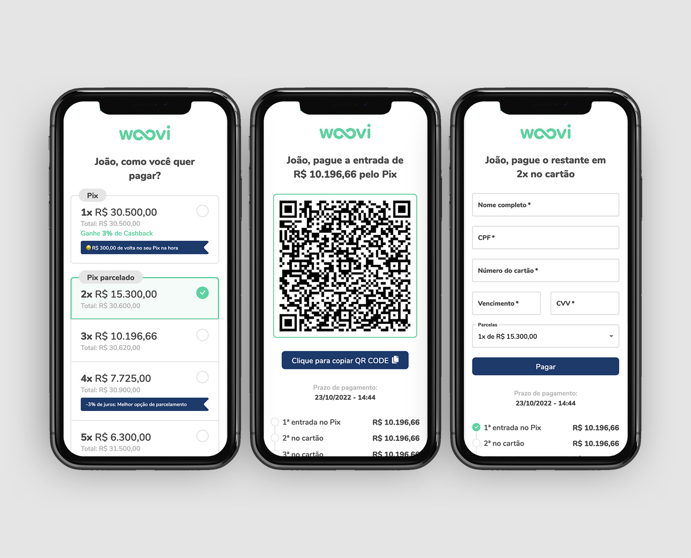

<h1 align="center" style="font-weight: bold;">Woovi Challenge 💻</h1>

<p align="center">
 <a href="#tech">Technologies</a> • 
 <a href="#started">Getting Started</a> • 
  <a href="#author">Author</a> •
 <a href="#contribute">Contribute</a>
</p>

<p align="center">
    <b>This is a project for the Woovi challenge.</b>
</p>

<p align="center">
     <a href="https://" target="_blank">📱 Visit this Project</a>
</p>

<h2 id="layout">🎨 Layout</h2>

<p align="center">
    
    
</p>

<h2 id="tech">💻 Technologies</h2>

- React
- Vite
- TypeScript 
- mui/material

<h2 id="started">🚀 Getting started</h2>

For help getting started with React and Vite, see the online site [documentation](https://vitejs.dev/guide/).

<h3>Prerequisites</h3>

Here you list all prerequisites necessary for running your project. For example:
- [VsCode](https://code.visualstudio.com/)
- [Vite](https://vitejs.dev/guide/)
- [NodeJS](https://nodejs.org/en)
- [Mui-Material](https://mui.com/material-ui/getting-started/)

<h3>Cloning</h3>

How to clone your project

```bash
git clone https://github.com/maykonwr/woovi-challenger.git
```

<h3>Starting</h3>

To install dependencies

```bash
cd woovi-challenger
npm install
```

How to start your project

```bash
npm run dev
```

<h2 id="author">👨🏻‍💻 Author</h2>

<table>
  <tr>
    <td align="center">
      <a href="#">
        <br>
        <sub>
          <b>Maykon</b>
        </sub>
      </a>
    </td>
  </tr>
</table>

<h2 id="contribute">📫 Contribute</h2>

Do you have any opinion and want to contribute to improving this project? Create a pull request and request a merge with all the necessary information

1. `git clone https://github.com/maykonwr/woovi-challenger.git`
2. `git checkout -b feature/NAME`
3. Follow commit patterns
4. Open a Pull Request explaining the problem solved or feature made, if exists, append screenshot of visual modifications and wait for the review!

<h3>Documentations that might help</h3>

[📝 How to create a Pull Request](https://www.atlassian.com/br/git/tutorials/making-a-pull-request)

[💾 Commit pattern](https://gist.github.com/joshbuchea/6f47e86d2510bce28f8e7f42ae84c716)